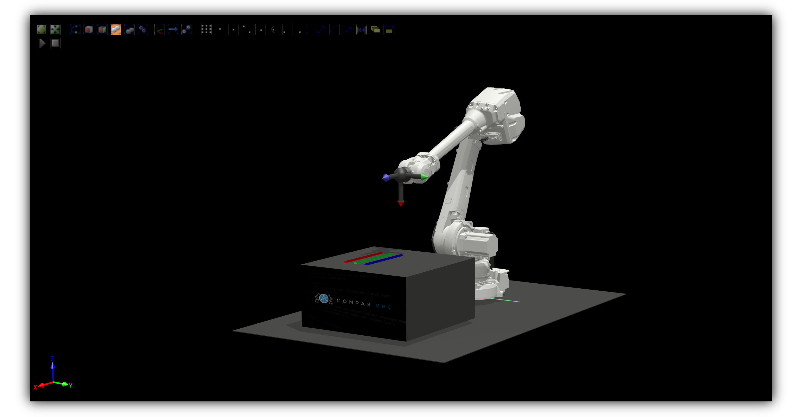

**********************************
Robot Motion with RRC
**********************************

This example demonstrates a movement for an ABB robot using COMPAS RRC python API.

To run the example:

* Start the robot where RRC driver is installed
* Start ROS driver using Docker (see example ``docker-compose.yml`` below)
* Run the code example

For more details, check the `COMPAS RRC Start <https://github.com/compas-rrc/compas_rrc_start>`_ repository.

.. literalinclude:: script.py
    :language: python

.. literalinclude:: docker-compose.yml
    :language: yaml
